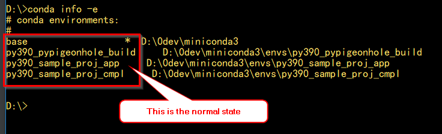
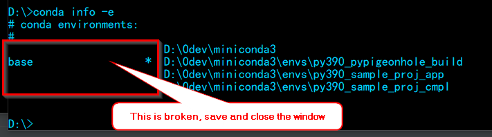

# Design and Implementation Details

It all started with dependencies, then one thing leads to another.
Ok, enough is enough once I get spoiled by Java Maven. Just want to see
how much time I can save from this. Maven has a plugin infrastructure for 
extensions. That's too much to build. So let's start from something smaller
and see how it goes.

工欲善其事，必先利其器。

## Design

- Dependency Management: 
    - pip is not convenient enough because of the C/C++ compilation. Python, 
      by nature, could have C/C++ library dependencies, such as numpy, PyQt, 
      etc. These C/C++ libs require compilation (and a compiler) for
      different OS. This is sometimes painful, especially on windows.
      >This does not mean that C/C++ is a drag for Python. In fact, this is a 
       strength Python has. If we need something faster than Python can do, do it 
       in C++ and wrap it.
    - Anaconda deals with this problem using pre-compiled packages. This 
      results one-click solutions since we don't need to worry about compilation,
      unless we create C/C++ libraries. we use conda packages whenever possible. 
      If conda does not have a package, then we fall back to pip.
    - We have 3 ways to define dependencies, setup.py, requirements.txt,
      and conda's environment.yml. The same information could duplicate 3
      times. 
    - pip can separate libraries between install_requires and tests_require and
      conda doesn't. Basically, we need to specify a dependency for development,
      runtime, or both.
    
  Based on the above, we create a simple structure to hold dependencies with
  enough information to cover most cases. It can populate the 
  dependencies to pip and conda. 
    
  we use python code to specify dependencies, rather than a property file.
  The python syntax check can reduce careless mistakes. The drawback is when 
  we update versions, we have to run text search on python code. This is so 
  far the only place where we need to use properties files. Please keep 
  __app_version assignment in the code unique, so the search on this string 
  returns unique result.

- Pip packages Python code, but not scripts and configurations for applications.
  So we employ conda for application assembling. Furthermore, conda serves as
  the application deployer implicitly.


## Implementation

- We isolate dependency specification to one place, 
  ```<project root>src\<project top package>\dep_setup.py```. For example, 
  if a project folder is foo-bar, then this is the project name and foo_bar 
  is the top package name. Then the dependency is in 
  foo-bar\src\foo_bar\dep_setup.py. 
  >We have to get hint on where the dependency file is. We don't want to put
  dep_setup.py under src. Otherwise, the installation would put this file
  outside packages under site-packages.
  
- The file name dep_setup.py is hard-coded as well. It's used to generate
  PIP's requirements.txt and Anaconda's environment.yaml, and version changes. 
  setup.py refers to this file as well. Basically we retrofit the information
  back to the current channels since they are widely used and referred.
  Otherwise, we may break a lot of tools based on this information. 
  >Please check in these generated files, but do not manually change them.
  GitHub uses requirements.txt to figure out the dependencies. GitHub action
  refers environment.yaml. Other CI tools may use these files as well.
 
  We have to deal with these in every project, so we isolate these changes 
  in one place. 

- We added scope to indicate whether dependencies are for dev or runtime.
  setup.py has install_requires and test_require, but environment.yaml and 
  requirements.txt miss it. So we need to fill the gap here. 
  
- The version is in app_setup.py. The release.sh auto-increments
  this value.

## Conda

Conda is tricky sometimes, especially in scripts on windows. Here are 
what we know unstable practices on windows:
  - do not call conda deactivate in a script with other conda commands. It
    does nothing sometimes.
  - do not call conda activate in a script, expecting you are in that 
    environment even when you get out of the script. You are in that 
    environment only when you are in the script.
  - do not call conda clean -a in a script with other conda commands.
  - The error: [Errno 13] Permission denied: '...\\vcruntime140.dll' happens
    when IntelliJ uses this environment, and we want to recreate this env.
    So close IntelliJ or temporarily switch to another environment before 
    re-creating conda environments. In normal cases, we won't create env
    many times in a project.
  - conda-build mislabels environments on windows. In that 
    case, open a new command window.
      
## GitHub CI

.github/workflows/python-package-conda.yaml: Most of the content comes from
GitHub's action template (Python Package using Conda from Actions tab on the
front page of a repo). It takes Conda's environment.yaml file to create Conda
environment, run flake8 and unit tests. 
>However, after the conda environment is set up, the Python executable is 
still pointing to the system wide Python executable. So we have to use 
```conda run``` before this gets fixed. 

>GitHub CI does not allow scripts, so we can't delegate to our unittest.sh.

>During CI, we check the svg file back to GIT, so that the above percentage
shows up. This requires every checkin to re-pull. There are other ways to 
get badges.


## Testing

In all cases, check the version deployed.
- https://pypi.org/project/pypigeonhole-build
- https://anaconda.org/psilons/pypigeonhole-build

#### To test pip packages locally:
___
pip uninstall pypigeonhole-build -y  
pip install dist\pypigeonhole-build-0.2.4.tar.gz  
python -c "import pypigeonhole_build.app_setup as ds; print(ds.get_app_version())"  
pip uninstall pypigeonhole-build -y  

pip install dist\pypigeonhole_build-0.2.4-py3-none-any.whl  
python -c "import pypigeonhole_build.app_setup as ds; print(ds.get_app_version())"  
pip uninstall pypigeonhole-build -y  

#### To test conda packages locally:
___
conda remove pypigeonhole-build -y  
conda install dist_conda\noarch\pypigeonhole-build-0.2.4-py_0.tar.bz2  
check envs\py390_pypigeonhole_build\Scripts for scripts  
python -c "import pypigeonhole_build.app_setup as ds; print(ds.get_app_version())"  
conda remove pypigeonhole-build -y  

#### To test pip packages remotely:
___
pip uninstall pypigeonhole-build -y  
pip install pypigeonhole-build   
python -c "import pypigeonhole_build.app_setup as ds; print(ds.get_app_version())"  
pip uninstall pypigeonhole-build -y  

#### To test conda packages remotely:
___
conda remove pypigeonhole-build -y  
conda install -c psilons pypigeonhole-build  
check envs\py390_pypigeonhole_build\Scripts for scripts  
python -c "import pypigeonhole_build.app_setup as ds; print(ds.get_app_version())"  
conda remove pypigeonhole-build -y  
check envs\py390_pypigeonhole_build\Scripts for scripts removal  

## Notes
- If I activate an environment from a command window, then the computer dies.
  After the computer comes back, the conda base environment points to that
  environment, not to the real base. I couldn't find a way to restore the base.
  So I have to reinstall miniconda, which is a pain.
- Conda-build cause the environment unstable, need further investigation. This
  is a good state 
  
  
  
  This is not 
  
  

  This is because the conda path is wrong. The issue https://github.com/conda/conda-build/issues/3813
  happens to conda-build as well. So after each conda build, check with 
  ```conda env list```.
  
  In this case, as long as we don't touch environments it's OK. Once we are 
  done, just close the window and start a new one.

We leave out the complexity of local artifact server setup. Variations are:
- local testing: use local files.

- private repo servers:
    - download/upload files
    - tunnel through to central servers for downloads.
